# Table of Contents
[Introduction](#introduction)<br>
[ROHub portal](#ROHub_portal)<br>
[ROHub portal pages](#ROHub_portal_pages)
- [Home](#ROHub_portal_pages_Home)
- [Basic search by keyword](#Basic_search_by_keyword)
- [Featured research objects](#Featured_research_objects)
- [Recent activity](#Recent_activity)
- [Key Statistics of ROHub platform](#Key_Statistics_of_ROHub_platform)
- [Login](#Login)
- [User account settings](#User_account_settings)<br>

[Research Object](#Research_Object)
- [Overview](#overview)
- [Content](#content)
- [Quality](#quality)
- [Activity](#activity)
- [Lifecycle](#lifecycle)
- [Relations](#relations)
- [Impact](#impact)<br>

[My ROs](#my_ros)<br>
[Explore](#explore)<br>
[Activity](#ro_activity)<br>
[People](#people)
- [User profile](#user_profile_people)<br>

[About](#about)<br>
[Support](#support)<br>


# Introduction <a name="introduction"></a>
[ROHub](htp://reliance.rohub.org/) is a research object management platform supporting the preservation and lifecycle management of scientific investigations, research campaigns and operational processes. As the only existing platform implementing natively the full research object model and paradigm, resources associated to a particular experiment are aggregated in a single digital entity (research object), and metadata reliant to understand and interpret the content is represented as semantic annotations that are user and machine readable.


ROHub can support different stakeholders, with the primary focus on scientists, researchers, students and enthusiasts, enabling them to manage and preserve their research work, to share it and make it available for publishing, to collaborate and to discover new knowledge.
However, other user groups can be benefited by ROHub like the Industry that can leverage
the platform to externalize their research to a community of researchers worldwide in multiple scientific domains, e.g., launching campaigns for research on specific topics, and to follow and monitor the progress. Similarly, investors can keep up to date and track scientific advances to fund and get involved in future breakthroughs. As another example, publishers can also leverage ROHub to advertise their journals with researchers, have access to a pool of potential reviewers, and implement more interactive review processes.

# ROHub portal <a name="ROHub_portal"></a>


ROHub portal is a Web client application providing a comprehensive user interface for the management and preservation of research objects (ROs). ROHub portal integrates and provides access to different research object services, such as:
* The core RO backend service, enabling the creation, storage, maintenance and access to research objects, the management of their lifecycle, and their preservation. The backend leverages various EOSC services including Zenodo and B2Share for RO publication, as well as B2Drop for resources storage (ongoing).
   * RO backend also includes a notification service, enabling the subscription to events related to a particular research object (e.g., changes in content or quality), or to the portal itself (e.g., when new ROs are created).
* The ROHub AIM (Identity and Access Management) service, powered by Keycloack open source solution, and which is integrated with EOSC AIM service (EGI check-in)
* RO enrichment service (also onboarded in EOSC), which generates automatically semantic annotations based on the (textual) resources aggregated in order to improve the discoverability and searchability of research objects.
* RO PDF generation service, allowing the retrieval of the RO in paper style in PDF format.
* EOSC (EGI) Notebooks (under integration) to allow the loading of notebooks aggregated in an RO directly on the EGI notebooks environment.
* RO checklists service (under integration), providing remote access to the minim-based evaluation of research objects, used to test for completeness, runnability or repeatability.
* RO stability service (under integration), enabling the evaluation of the RO through time by capturing concrete values provided by the checklist service in different moments of its evolution. It allows testing the ability of a research object to achieve its original purpose after being subject to changes on its resources.
   * RO stability includes the RO monitoring tool, providing an interface to visually monitor and keep track of the status of external datasets and web services required for workflow execution. It's based on the stability service.
* RO collaboration spheres (under integration), providing an interface for the discovery of research objects that are similar or related to the selected research object or scientist.

## ROHub Portal pages <a name="ROHub_portal_pages"></a>
### Home <a name="ROHub_portal_pages_Home"></a>
The homepage or landing page provides a general overview of the ROhub platform which includes a keyword search component from which the user can directly start finding research objects and creator information, a section for the featured research object where selective research objects (golden examples) can be featured based on their completeness and impact factor. The landing page also includes a section for the key statistics of the ROHub and a section with the recent activities showing the latest changes or events on the ROHub platform. The figure below depicts the partial view of the homepage of ROhub portal.

<p align="center"> 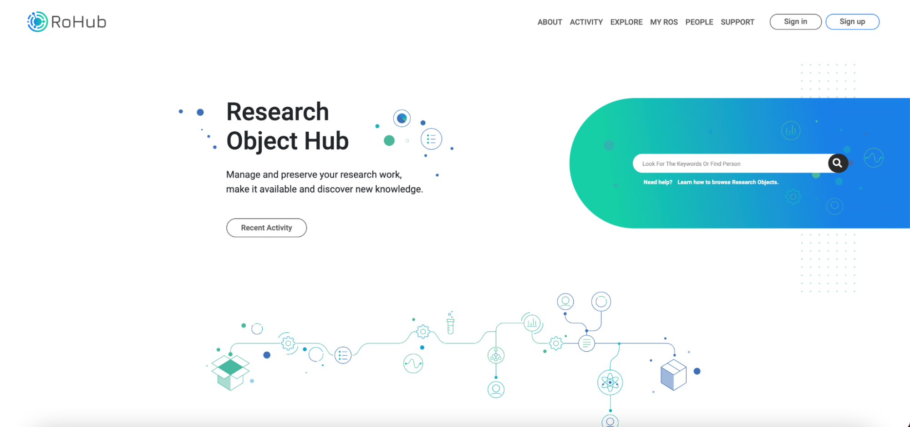 </p>
<p align="center">  </p>
<p align="center">  </p>
<p align="center">  </p>


<div align="center"> Figure 1: Landing page of the ROHub platform </div>

#### Basic search by keyword <a name="Basic_search_by_keyword"></a>
This component enables users to find research objects by keywords, looking through all the metadata annotations available, e.g., title, description, creator, etc. The user can easily look for research objects or resources by providing any associated keyword and thereafter the user can look for the desired resources from the explore page.


<p align="center"> 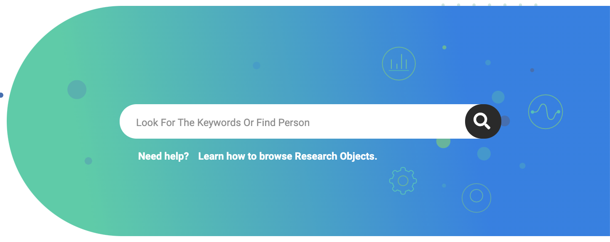 </p>
<div align="center"> Figure 2: Keyword search component </div>

#### Featured research objects <a name="Featured_research_objects"></a>
This section presents the list of ROs that are promoted because of their quality (measured based on the RO compliance according to some specified criteria like completeness, impact etc.) or because of their popularity (e.g., golden examples) as depicted in figure below.

<p align="center"> 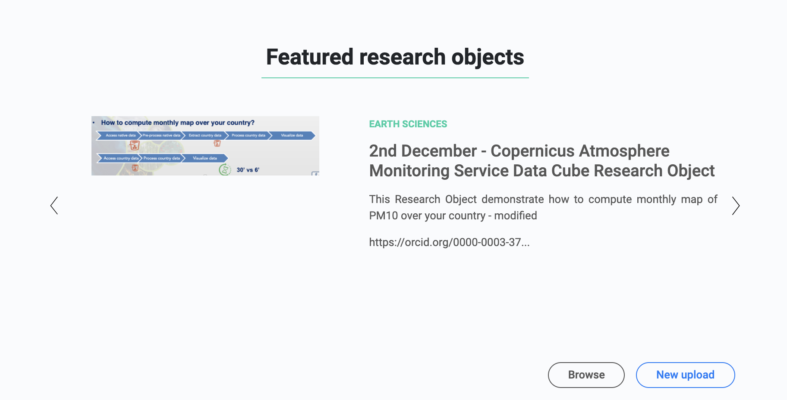 </p>
<div align="center"> Figure3: Featured research objects component </div>

#### Recent activity <a name="Recent_activity"></a>
This section presents the latest three ROs that were created most recently, resources added to research objects, snapshots or archives or any recent activities on the ROs. By clicking on the “Read more” the user can go to the main RO overview page for detailed representation.

<p align="center"> 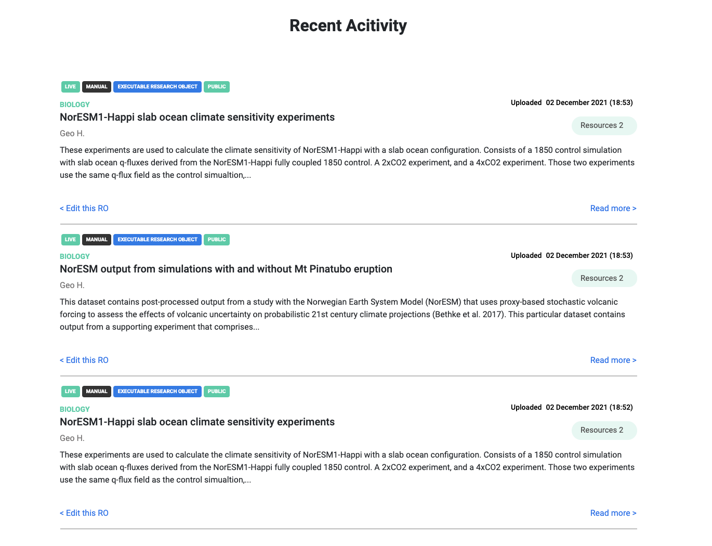 </p>
<div align="center">Figure4: Recent activity component </div>


#### Key Statistics of ROHub platform <a name="Key_Statistics_of_ROHub_platform"></a>
This section of the landing page shows the key statistics of the ROHub platform consisting of the number of research objects created with all the resources, total number of annotations, total number of users in the portal.


<p align="center">  </p>
<div align="center"> Figure 5: Key statistics of the ROhub platform </div>


### Login <a name="Login"></a>
The login (Sign in/Sign up) is available on the menu bar of the homepage. The keycloak authentication system allows the users to login either with predefined EGI credentials or users can register themselves with login and password. Once registered the authentication system allows the registered users to sign in to the ROhub portal. The figures below show the login and sign up functionalities of the ROhub portal.

<p align="center"> 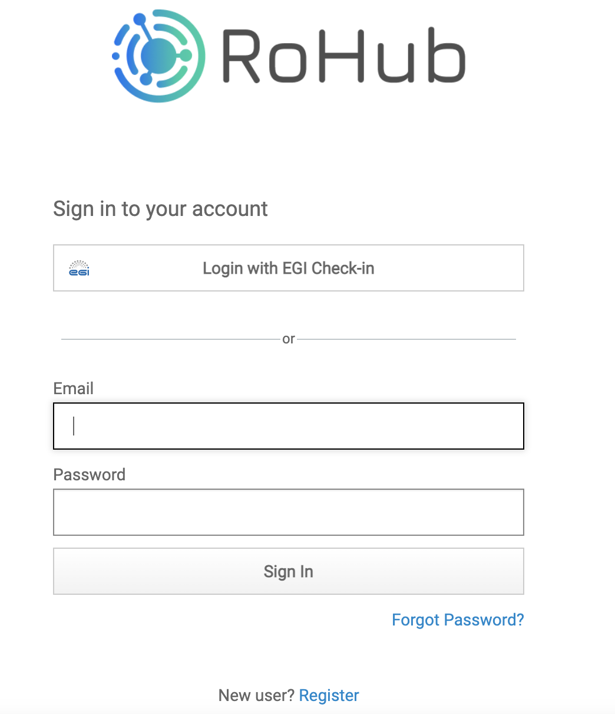 </p>

<div align="center"> Figure 6: Login page of ROhub portal </div>


<p align="center"> 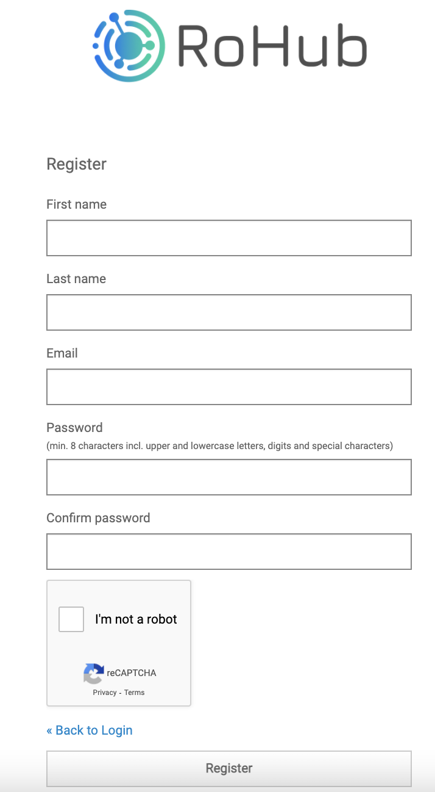 </p>

<div align="center"> Figure 7: User registration page of ROhub portal </div>


#### User account settings <a name="User_account_settings"></a>
The user account settings can be accessed by the users once they are logged into the portal. There are various components that can be access via the user account setting page, such as:
* Edit Account: In this page the user can update and save the personal user-specific information to update the account. This information includes email, firstname, last name, affiliation of the user etc.

<p align="center">  </p>
<div align="center"> Figure 8: Edit Account page for ROHub users </div>


* Change password: This section enables the user to change the password of his account in ROHub. This password is independent of the EGI check-in password.


<p align="center"> 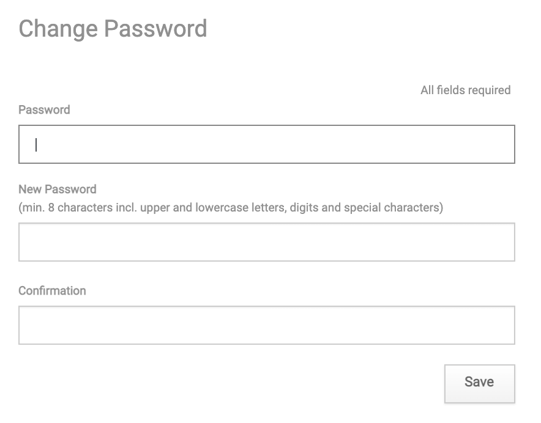 </p>
<div align="center"> Figure 9: Password reset page </div>


* Authenticator: This system allows the user to save the device as a second level authentication. This is done through third party authentication applications (e.g. FreeOTP, Google Authenticator). The application scans the barcode provided in the user’s account and generates an OTP which along with the name of the device can be saved.

<p align="center"> 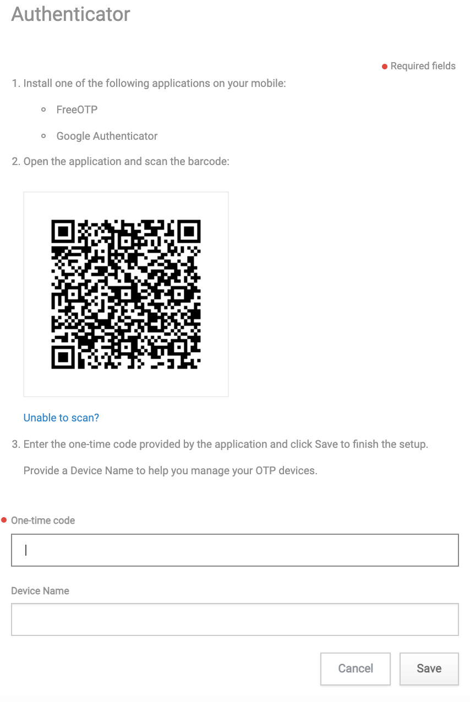 </p>
<div align="center"> Figure 10: User Authentication in ROHub platform </div>


* Federated identities: This section shows the user identity in EGI check-in, if any, which is essentially the username of the user in EGI.
* Sessions: Shows the current sessions for the user account. The session record consists of information like the  user IP address, the start and end time of the session etc.
* Applications: This section shows the IAM application clients that this user is able to use to authenticate in ROHub, along with the roles and permissions associated to this account. The client used is generally transparent to the user, as it is set internally by the application itself (e.g., ROHub portal, ROHub python library, Enrichment service, etc.).


<p align="center"> 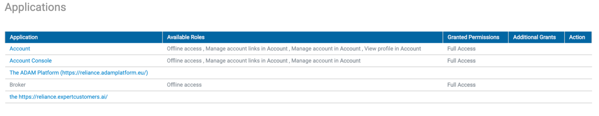 </p>
<div align="center"> Figure 11: Page showing applications accessed by a ROHub user </div>


* Log: This section shows all the available activity log for the user account in ROHub, including the date of the event, type of the event (i.e., login), IP source, application client used, and any additional information like the username and authentication method used.


### Research Object <a name="Research_Object"></a>
The ROHub users can access a research object either by the keyword search or from the explore page. The metadata of a specific research object in the ROHub platform can be categorised in various sections as described below.
#### Overview <a name="overview"></a>
The overview section of the research object displays the essential information/metadata and enables the manipulation of the research object. It consists the following subsections:
* The main metadata includes the title, description, research areas, research object type, creation mode, creation date, last modification date, creator’s identity and relevant sketch associated with the research object.
* Some especially relevant metadata elements might include the geospatial information associated with the research object that can be displayed in a map popup window, and the annotations added automatically by the semantic enrichment service.
* The overview page also gives a summary of the contents encapsulated within the research object inspite of having a separate section for contents in the research object. The content subsection within the overview page shows the relevant contents and enables the user to navigate through them.
* Within the overview page the Activity subsection summarizes the recent activity done on the research object. The user will be transferred to the main activity page within the research object on clicking the “View all” option.
* The overview also contains the Lifecycle chart subsection where the evolution of the research object can be summarised for the user. From this subsection the user can navigate to the main lifecycle page of the research object on clicking “View all”.
* The overview also contains the annotations added automatically to the research object by the semantic enrichment service. Selecting “Show All Annotations” at the end of the overview panel, drops down all the annotations added to the research object. Each annotation pops out in a separate window on clicking one of the annotations listed within the list. The user can also hide the annotation list on clicking the “Hide Annotations”.
* On the right side of the overview page contains the various toolbars such as:
   * Summary of the RO including the number of views, downloads, resources, annotations, activity events, forks, snapshots/archives, as well as the RO quality score, and the research object size.
   * “AGENTS” subsection holds the usernames of the creator and the importer associated with the RO.
   * “QUALITY” shows the status of the quality of the RO in regard of its completeness.
   * “KEYWORDS” subsection holds the relevant keywords associated with the RO
   * “TOOLBOX” section allowing the user to download the research object, or its metadata; to get the research object atom feed that can be used to subscribe to the research object notifications; manage the research object evolution if the user is allowed (e.g., to create snapshots, archives, or fork the research object); manage the research object annotations if the user is allowed (e.g., to update the annotations from the semantic enrichment service, import an annotation body, or display the advanced annotation view
   * “SHARE” allows the user to share the RO over social media or by directly creating shareable link (function still not available)
   * “Cite As” subsection shows the citations used in the RO (if any)
   * “LICENSE” subsection shows the associated license of the RO (if any) and the contents enclosed with the RO.
   * “GRANTS” subsection allows the user to see the funsing body supporting the research.
The figure below depicts a basic overview page of a research object in the ROHub platform.


<p align="center">  </p>
<div align="center"> Figure 12: Research Object overview page </div>

#### Content <a name="content"></a>
This section shows the aggregated resources in a research object where the user is enabled to browse and navigate through the resources. The resources can also include folders and subfolders. When the user selects a resource, its metadata information is displayed at the end of the page along with the annotations added in the ROHub platform for that particular resource. The Content page of a research object comprise of the following sections:
* The navigation section lists the RO contents that shows  metadata like the size or number of resources in a folder, creation time and date, creator identity etc. This page also allows the user to add resources manually or either uploading the resources by directly draging and droping in the webpage or choosing files locally from the user's desktop. The user can create a folder within a parent folder, add resouces from external links or can upload them directly in the portal from this section.
* The resource details section, which appears after the user selects (or clicks on) a resource in the navigation panel. It shows basic resource metadata e.g. title, resource type, number of contents in case of folder, URI (in case of a single resource element), creation date, modification date, author etc. Moreover on selecting a resource the content section shows actions on these resources from where the user is allowed certain actions like moving the content across various folders, edition, deletion etc.
* On selecting a single resource the user is allowed to see the available annotation list associated with the resource.  On clicking the “Show Annotations” the user can see the annotations associated with that particular resource selected by the user.
The figures below give a better understanding of the content section of a research object.

<p align="center">  </p>
<div align="center"> Figure 13: Content navigation list </div>

<p align="center">  </p>
<div align="center"> Figure 14: Resource metadata and action bar in Content Section </div>


<p align="center">  </p>
<div align="center"> Figure 15: Resource metadata and annotations in Content section </div>


#### Quality (under construction) <a name="quality"></a>
This section of the RO will enable users to assess the quality of a research object according to some predefined quality criteria (e.g. completeness). This section interacts with the quality checklist service to showcase the desired results. Additionally, this section enables the RO monitoring tool to assess the RO quality through time. Presently this section is under construction.


#### Activity <a name="activity"></a>
This section is a specialisation of the main activity search page of the ROHub and only presents a list of notifications that were generated by the system regarding the activity done on the selected RO only (e.g., changes in the RO content, modification of resources, and their associated metadata, including comments) and quality (e.g., changes in the completeness, stability and reliability). The user can see the list containing the dates of creation of the activities, name of the activities as events and the user identity responsible for the activities. The user can sort the activities in a selected RO by date of creation (e.g. ascending or descending). There are filtering capabilities also present for the user to browse through the activities. Currently available filters allow searching for activities that have occurred in specific time or involve specific users or by specific objects. Moreover the annotations present for each RO activities can also be downloaded on clicking. The figure below shows the activity section of the RO selected.


<p align="center"> 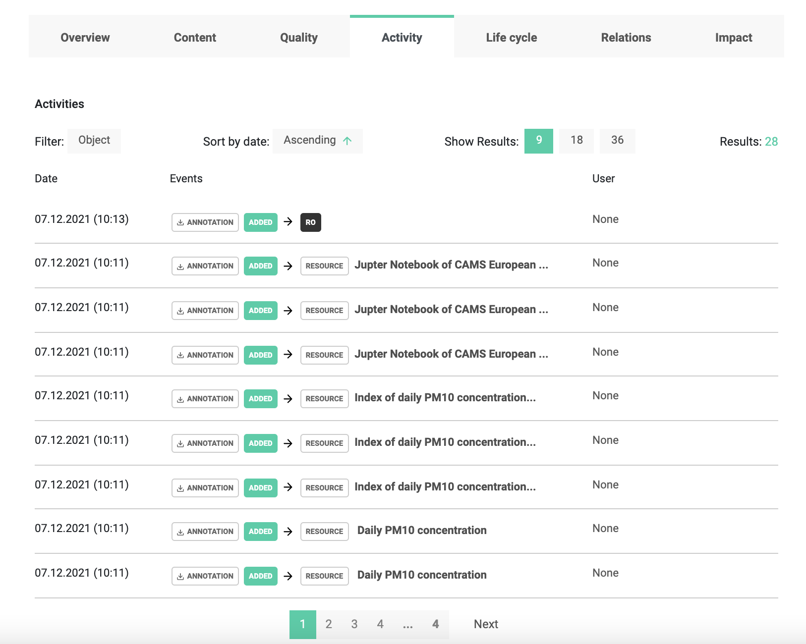 </p>
<div align="center"> Figure 16: Activity section of a Research Object  </div>


#### Lifecycle <a name="lifecycle"></a>
This section displays the RO evolution, including the snapshots, forks, and on completion the archive (release) generated for the RO throughout the whole evolution time. The lifecycle chart provides a graphical representation of the related RO for live/snapshots/forks/archive and also the subsequent list of events of the RO over the period of timeline. The user also can navigate to the RO activity page from this section. The figure below depicts the life cycle section of a selected research object.


<p align="center"> 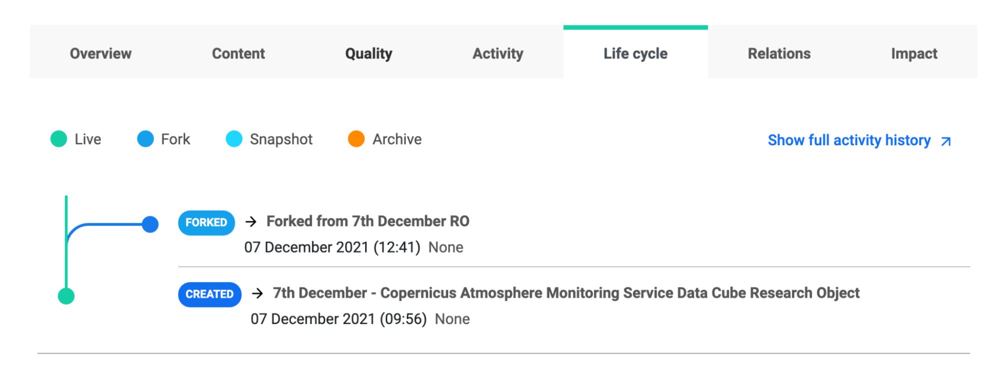 </p>
<div align="center"> Figure 17: RO Lifecycle section  </div>

#### Relations <a name="relations"></a>
This section of the ROHub portal visualises the semantic relations between two resources. This section is intended for advanced users. The users can see the relations between the resources where the first one must be the selected research object or an aggregated resource, while the second could also be an external resource. The figure below depicts a visualised relationship  between two resources in the ROHub platform.


<p align="center"> 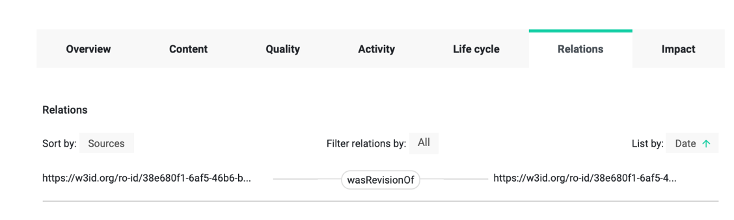 </p>
<div align="center"> Figure 18: RO relations section </div>


#### Impact (under construction) <a name="impact"></a>
Though this section of the RO is under construction This section presently has two sections. The first section presents a graph of the number of activities through a time period of one year and the second section presents the statistics related to research object impact, including the number of views, downloads, forks and number of activities through a time period of a month.


<p align="center"> 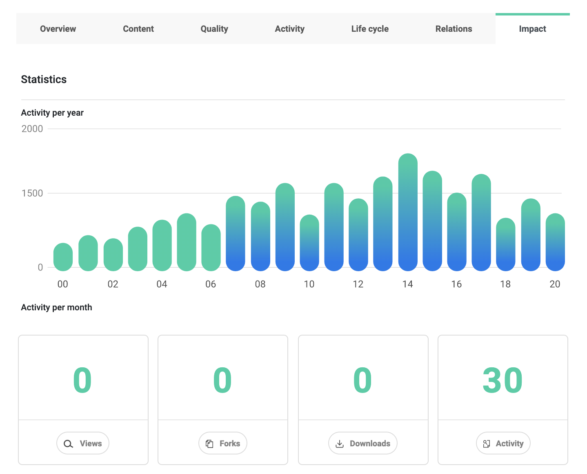 </p>
<div align="center"> Figure 19: Impact of the research object </div>


### My ROs <a name="my_ros"></a>
This section in the ROHub platform enables an authenticated user to create a research object directly from the user interface of the portal. When a user signs into the portal and on clicking the “My ROs” from the top menu bar gets into the page where he can create new research objects from scratch, see his own created ROs as well as the ROs he is allowed to edit in the platform. The users can also delete any unwanted RO from this page. The entry page in the My ROs section is shown in the figure below.


<p align="center"> 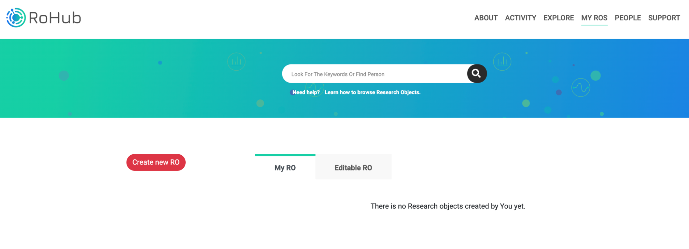 </p>
<div align="center"> Figure 20: Entry page of the My ROs section </div>


The user can create a research object on clicking the “Create new RO” from the “My ROs” page. On clicking the user is transferred to a form where the user can enter the contents and metadata of the research object to be created. On clicking “Create and Continue” this page allows the user to navigate through other forms to add the various relevant data in order to enrich the research objects such as:
* “Basic information” form allows the user to add the key information such as title, description, access mode, editor and owner identities, research areas related to the RO and the type of RO.
* “Authors & contributors” form allows the user to add identity information about the authors and contributors.
* The form named “tags” adds relevant tags and related keywords to be used in the research object.
* “Sketches gallery” for uploading sketches related to the research object.
* “Resources” allows the user to add folders and subfolders and add specific types of resources for the research object.
* The user can also upload specific geolocations (e.g. GeoJSON files) as per relevance of the research object through the form named “Related locations”.
* “License & Funding” form allows the creator to add licences and funding information used in the reach object.
* There is another form called “Other metadata” page where additional metadata could be added in the research object
At the bottom of  the first form page the user can also exit from the process of RO creation on clicking “Create and Exit” and come back again to populate the other forms, also there is the possibility of resetting the form on clicking the “Reset form.” The figure below shows the main page and the forms for creating research objects in the ROHub platform.


<p align="center"> 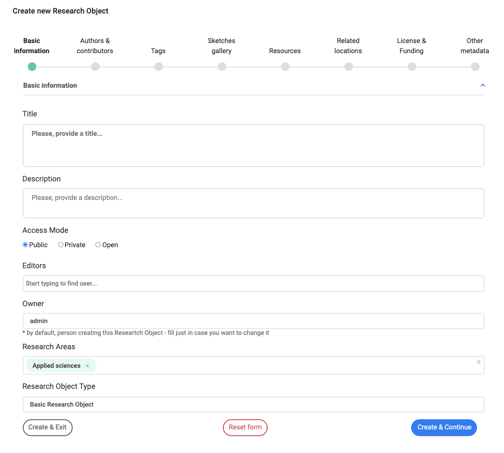 </p>
<div align="center"> Figure 21: RO creation via ROHub </div>

### Explore <a name="explore"></a>
The Explore page can be accessed by the user on clicking “EXPLORE” from the topmost menubar of the ROHub platform. This section enables the user to browse and navigate the research objects collection by organising them according to their semantic properties and allowing users to discover the objects by applying multiple search filters. By default the explore page lists all the available ROs, the user can sort them according to ascending/descending data of creation. The number of ROs in one page can be changed too from the explore page for the user. From the explore page the user can browse/search ROs in the following ways:
* Faceted search results view where the user can search for keyword specific research objects from the keyword serah box present at  the top of the explore page. This fetches the list of research objects according to the keywords used for the search. The view is made by default in list view and another option of image icon (wherever available) for each RO is available. In both cases the same information about ROs is presented. Each research object in the list contains the key metadata like title, description, RO type, research areas, creation date and time etc. as depicted in the figure below. On clicking the “read more” the user can enter into the research object with its respective sections as described in section 2.3.


<p align="center">  </p>
<div align="center"> Figure 22: Faceted search results of ROs </div>


* Filter search allows the user to further filter the results of the fetched ROs according to various criteria. The figure below shows the filter section present in the left side of the explore page. On cycling the green drop-down icon the user can select the options from each filter section and also can reset all the filters from this section.

<p align="center"> 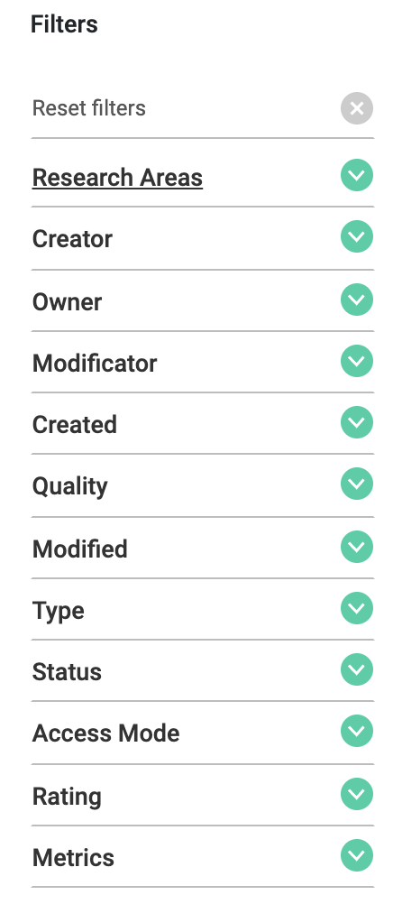 </p>
<div align="center"> Figure 23: Filter section of the explore page </div>

Each filter section has various options to choose so that the user can filter through the most desired results of the research object. The subsections and their figures are as follows:
* Research Areas: In the filter the user can select the from a vast range of research areas (broadly in applied sciences, earth sciences, life sciences, physical sciences and space science) available in the ROhub platform to fetch the results from those specific research areas.


<p align="center"> 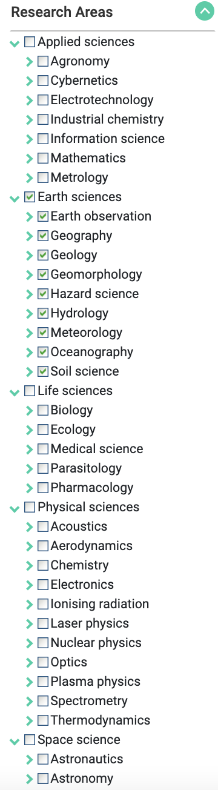 </p>
<div align="center"> Figure 24: Research area filter options </div>


* Creator: The ROHub platform allows the user to filter the research objects from the platform based on the identity of the creators. The user can provide the names of single or multiple creators (from the signed up users of ROHub) to see the results of the research objects created by them.
* Owner: On providing the names of owner/s the user can filter the research objects based on the information provided.
* Modifictors: Similarly the user can filter the ROs based on the information of the modificators.


<p align="center">  </p>
<div align="center"> Figure 25: Filter options for Creator, Owner and Modificator </div>

* “Created” filter allows the user to provide the range of creation dates so that the platform can fetch the ROs according to the dates of creation.


<p align="center"> 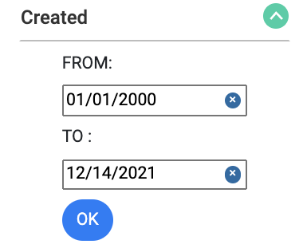 </p>
<div align="center"> Figure 26: Creation date filter </div>


* “Quality” filter fetches the ROs according to their quality as per completeness level.


<p align="center"> 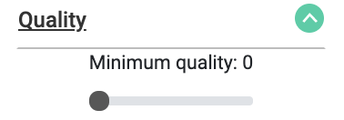 </p>
<div align="center"> Figure 27: Filter for RO Quality </div>


* “Modified” allows the user to select and filter the ROs modified on a desired date range provided by the user.


<p align="center"> 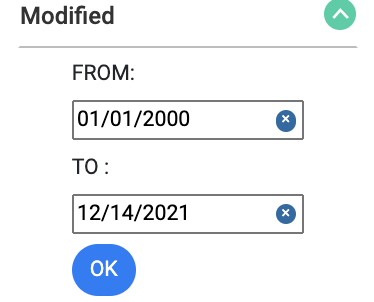 </p>
<div align="center"> Figure 28: Modification date filter </div>


* The “Type” filter can be used to choose the relevant research object types available on the ROHub platform.


<p align="center">  </p>
<div align="center"> Figure 29: RO type filter </div>


* “Status” filter is for filtering the research object based on their status (e.g. live, archived, forked or snapshot). Multiple filter criteria can be applied by the user to fetch the results.


<p align="center"> 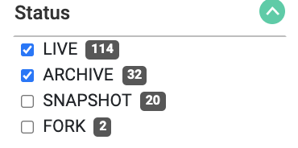 </p>
<div align="center"> Figure 30: RO status filter </div>


* Through the “Access mode” filter the Public or private ROs can be selected by the user.


<p align="center"> 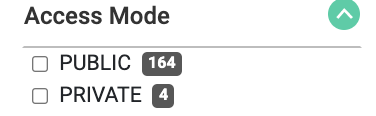 </p>
<div align="center"> Figure 31: RO Access mode filter </div>


* “Rating” filter allows the user to select the research objects from the range of ratings from <1 to >4.


<p align="center"> 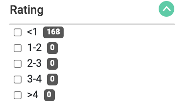 </p>
<div align="center"> Figure 32: RO rating filter </div>


* “Metrics” is the filter for selecting research objects based on the quantitative values of its metadata elements like folders, resources, annotation, aggregations as well as other portal specific elements like number of views, downloads, likes, dislikes, snapshots, forks, archives and ratings.


<p align="center">  </p>
<div align="center"> Figure 33: RO Metrics filter  </div>

### Activity <a name="ro_activity"></a>
The activity page  can be accessed from the topmost menubar of the ROHUb portal. This section comprises the two sections:
   * Global Activity List is the one that summarises and presents all activities conducted by all users on all research objects available in ROHub. This list comprises mainly of the Date and time of the performed activity, activity event describing the type of activity (e.g. creation of a RO, addition of resources, addition of annotations etc.) and the name of the ROHub User who performed the activity (link of the userprofile page). Additionally in case of activities involving annotations the user can download the annotation simply by clicking on the icon “Annotations”.
   * Activity search filter is the section where the user can add criteria to find the list of specific activities passed through the filter by the user for searching through the activities, including the activity type and resource type, research area and username of the responsible creator.
The figures of the global activity list page and the filter view are provided below.


<p align="center"> 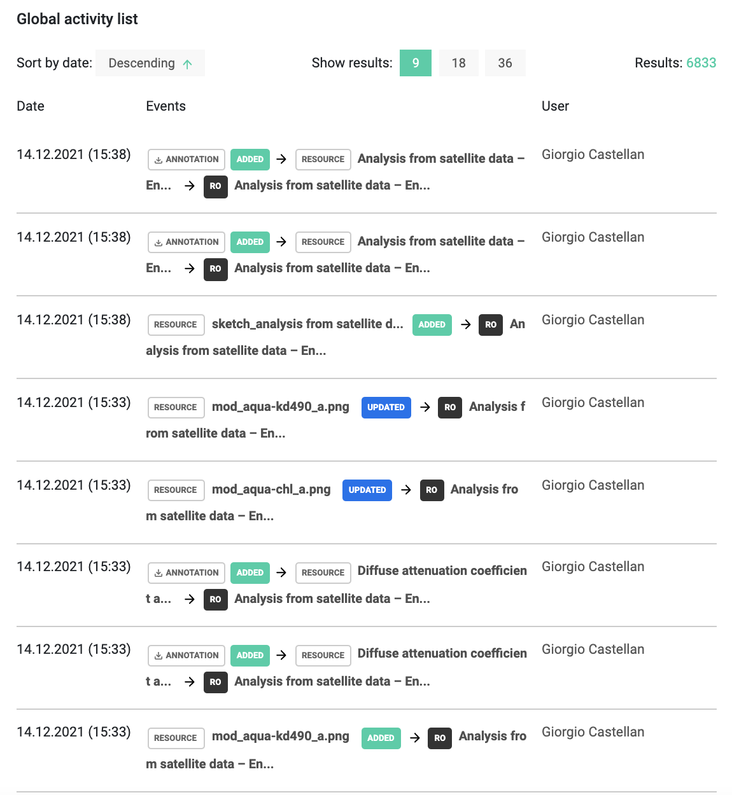 </p>
<div align="center"> Figure 34: Activity List </div>


<p align="center"> 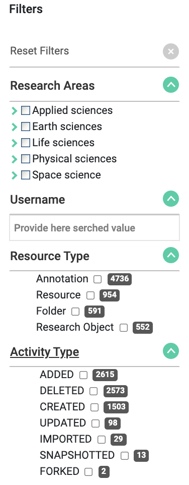 </p>
<div align="center"> Figure 35: Activity search filters list section </div>

### People <a name="people"></a>
This section of the ROHub platform can be accessed from the main topmost menu bar located  in the main landing page of the portal on clicking the “People”.  Once a user is in this section three distinct subsections are visible. A search box for searching the ROHub users by name or surname, a taskbar with alphabets in order to browse the users alphabetically on clicking on each alphabets and finally the list of users fetched as per the search of the user. By default this list provides a global list of all the ROHub users. The subsections can be described as below:
   * The search box for ROHub users allows the users to search for any ROHub user simply by providing their name and/or surname and the results will be provided in the list below. From the list the user can navigate to the user profile of the specific user on clicking “Read more”.
   * The alphabetical browsing of the ROHub users allows users to navigate and fetch results of the users starting their names from A to Z. Once the user clicks on an alphabet, all the users with their names starting with that alphabet get listed from where the user profile of any user can be accessed to get more user specific information about the ROHub user.
   * By default the list of ROhub users contains all the available ROHub users registered in the portal. A user can sort the list alphabetically depending on the names. From the users list the user profile can be accessed by clicking “Read more” for more information about the users and their associated activities on the platform.
The figure below shows the people page of the ROHub platform showing the above-mentioned subsections.

<p align="center"> 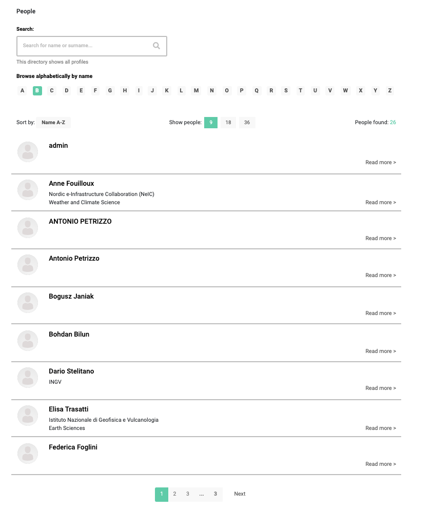 </p>
<div align="center"> Figure 36: People search in ROhub  </div>


#### User profile <a name="user_profile_people"></a>
In the ROHub platform the “User profile” can be accessed from the “People” section on clicking the “Read more” available for a specific registered user. Inside the User profile we can find various subsections. On the left side panel the profile picture is available for the specific user (if available). Besides that there are few subsections, such as:
   * Overview section shows personal details of the user such as professional description, the user’s affiliation and research areas of the user.
   * Contact shows the email of the user and also the social media handles of the user if provided.
   * Research Objects is the section which shows the list of the ROs on which the user has performed some activity. If there is nothing to show this section will be simply empty.
The figure below shows a general overview of a user profile page.

<p align="center"> 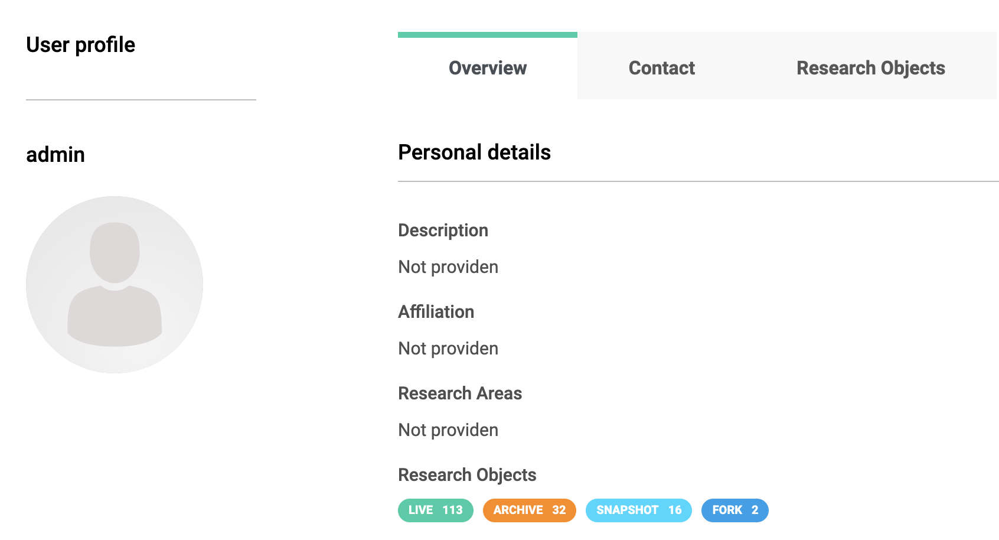 </p>
<div align="center"> Figure 37: Overview of a User Profile  </div>

### About <a name="about"></a>
This section of the ROHub platform provides the user with the most basic information about the ROHub platform. The various sections of the about page can be navigated by the user from the left side panel of the “About” page. Each subsection opens a separate page once the user clicks on the sidebar options. The subsections are as follows:
   * What is ROHub?: This page includes a short introduction to the ROHub and the technical components of the portal backend and  their orchestration. Here the user can read and understand the basic working principles of ROHub in an easy way targeted for all categories of users.
   * What is Research Object?: This page provides information about the basic idea behind the concept of Research Object and its implementation in the ROHub platform. This page provides the schematic diagrams of the workflows associated in a research environment and its aggregation as a research object.
   * Privacy Policy: This section allows the user to know about the data protection policies followed in the ROHub platform to protect the user and also to ensure that the user gets the most reliable content available.
   * Terms of service: This page explains the user and the stakeholders about the terms they should abide by while using the ROHub platform and its digital resources.
   * Some sections like the “News ” and “Showcase” ar still under construction
   * The publication sections show the information of the avail publication regarding ROhub in well known platforms or conferences.
   * The “Team” section holds the list of the current and the previous team members who worked on ROhub development.
   *  There is a “Contact” section where the user can find the contact details such as email id and telephone for support and also the address of the affiliated institution.
The following figures show the various above-mentioned sections of the “About” page.


<p align="center"> 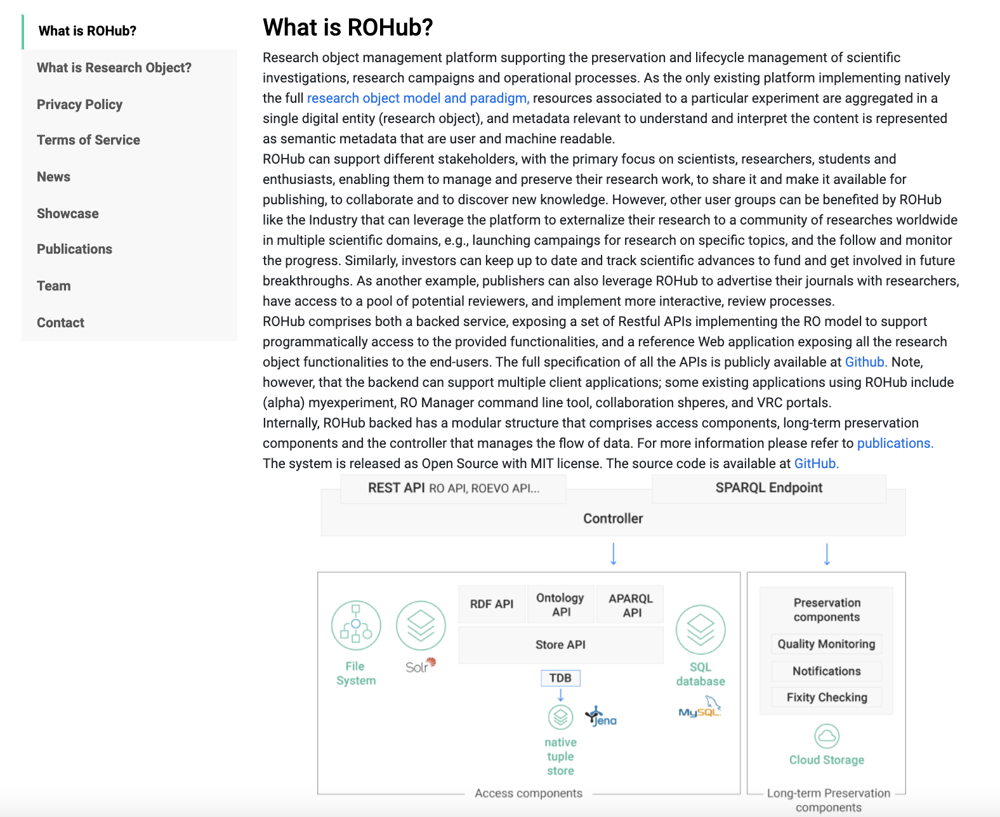 </p>
<div align="center"> Figure 38: ROHub details  </div>


<p align="center">  </p>
<div align="center"> Figure 39: Research object information </div>

<p align="center"> 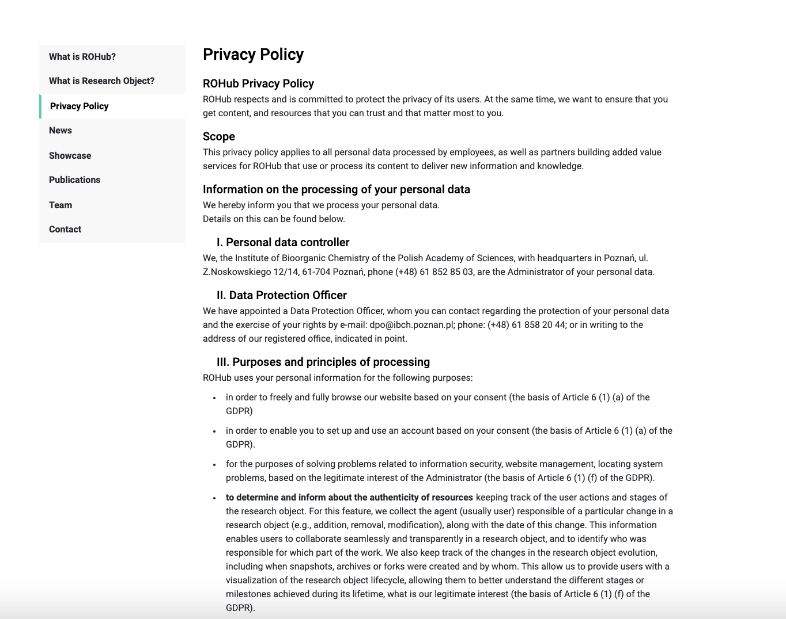 </p>
<div align="center"> Figure 40: Privacy policy of ROHub </div>


<p align="center"> 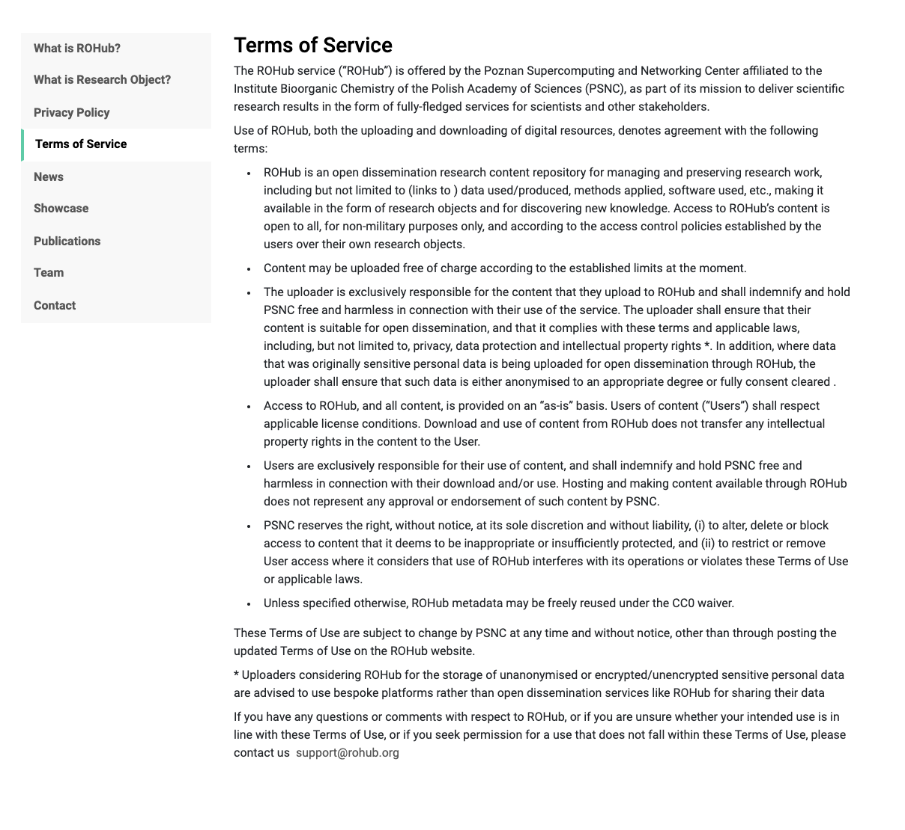 </p>
<div align="center"> Figure 41: Terms and Services for ROHub users </div>


<p align="center"> 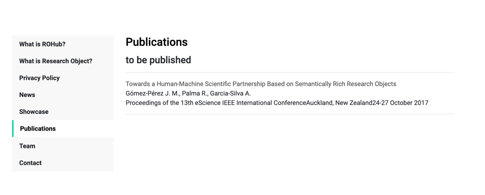 </p>
<div align="center"> Figure 42: Publications on ROHub platform </div>


<p align="center">  </p>
<div align="center"> Figure 43: Team of ROHub platform </div>


<p align="center"> 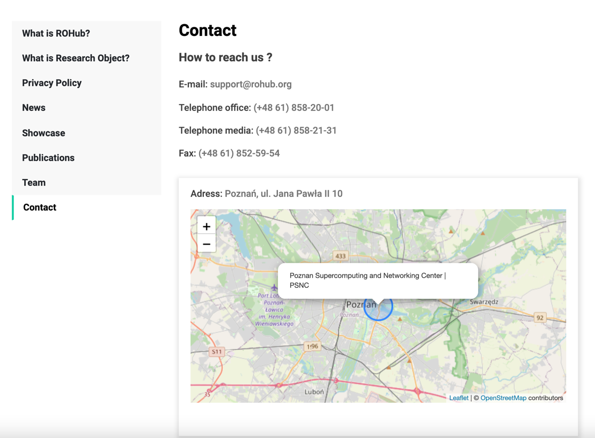 </p>
<div align="center"> Figure 44: Contact details for ROHub support </div>

### Support <a name="support"></a>
The support page can be accessed from the top menu bar as well as from the bottom of the ROhub landing page. In the support section the user can find the ROHub documentation and a brief summary of how to browse the research objects present in the platform. There will also be a frequently asked question section which is still under construction. The documentation of the ROHub is still to be updated and on completion the users can download it in pdf form from the support section. The figure below shows the support section of the ROHub platform.


<p align="center"> 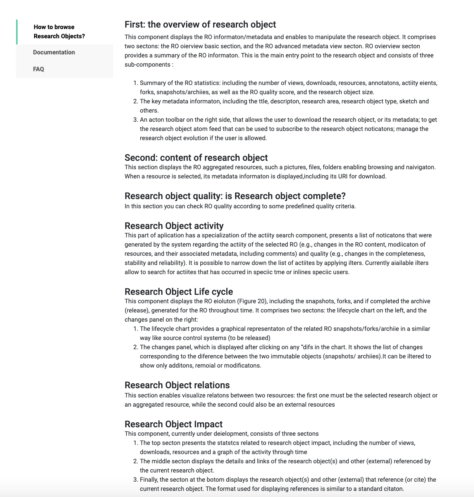 </p>
<div align="center"> Figure 45: Support page of the ROHUb platform </div>


<!--
### Markdown

Markdown is a lightweight and easy-to-use syntax for styling your writing. It includes conventions for

```markdown
Syntax highlighted code block

# Header 1
## Header 2
### Header 3

- Bulleted
- List

1. Numbered
2. List

**Bold** and _Italic_ and `Code` text

[Link](url) and 
```

For more details see [Basic writing and formatting syntax](https://docs.github.com/en/github/writing-on-github/getting-started-with-writing-and-formatting-on-github/basic-writing-and-formatting-syntax).

-->

